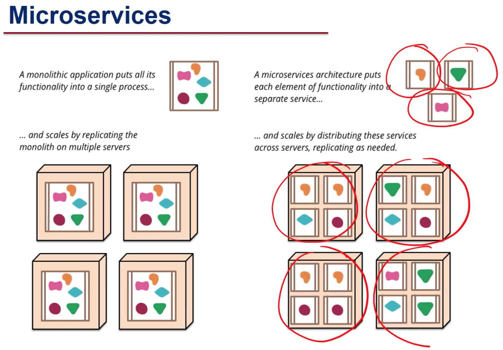

Source: [Programming for the Web with JavaScript](https://github.com/elloo/p1xt-js-2.0-guided-studies/tree/master/programming-for-the-web-with-javascript)

# Using APIs with React

Design paradigms should have the following goals:

* Break up code into distinct components
* The components interact with each other in a "standard" manner
* Makes it easy to change any component
* Less dependency and coupling

__ Service-Oriented Architecture__

Letter by Jeff Bezos to all employees at Amazon (circa 2002):
* "All teams will henceforth expose their data and functionality through service interfaces."
* "The only communication allowed is via service interface calls over the network."
* "All service interfaces, _without exception,_ must be designed from the ground up to be externalizable. That is to say, the team must plan and design to be able to expose the interface to developers in the outside world."

__ Software as a Service (SaaS) __

Extends the idea of Service-oriented Architecture.
Uses microservices architecture.

The entire software runs as a service e.g.
* Google Docs (as opposed to Microsoft Word)
* Gmail (as opposed to email clients like Outlook)
* Cloud9 (as opposed to Eclipse)

Advantages include:
* No user installation is needed
* Less likely to lose data
* Users can collaborate with each other
* Upgrading software and datasets is easy
* Software is centralised in a single environment (don't need to worry about versions of OS, etc)
* User's computer (hardware and software specifications) don't matter - usually all that's needed is a web browser



Both Service-Oriented Architecture and SaaS simplify the creation of web applications by allowing for combinations of online components. The main idea is that, rather than being implemented as a monolithic piece of software, applications are “services” that provide data and functionality to other software that need them, and that these “services” are accessible over the network.

## What is an API?

_How do well-designed web servers behave?_ 
Define a set of rules and conventions

__REST:__ REpresentational State Transfer
* Web data is a collection of resources on which specific operations can be performed
* URI (Uniform Resource Identifier) names _resources_ - not pages or actions
* Self-contained - which resources, what to do with it, server doesn't need to maintain state between requests

An API is an __Application Programming Interface__
* In web programming, an API is a URL or a set of URLs that returns pure data to requests
* APIs can be used to incorporate data and functionality from other sources in your webapp

__$.getJSON__ - This jQuery AJAX function sends an HTTP request to the specified URL and expects a JSON object in return; it then invokes the specified callback function and passes the JSON object to it as an argument.


## Node.js

Node.js is a free, open-source platform and framework built in JavaScript
* Includes a suite of tools that allows users to prepare JavaScript (and thus React) applications for deployment
* Utilises Node.js Package Manager (npm) to install programs and manage dependencies

__Benefits__
* Instead of including all JavaScript code in a ```<script>``` tag, now we can separate the components into different files to make code more modular.
* Node.js allows us to incorporate dependencies of the code within the current file
    * Keywords are _require_ and _import_

When creating a React app, Node.js allows for these considerations:
* Including dependencies (React, React-DOM libraries, etc)
* Making code compatible with browsers that only support older versions of JavaScript
* Transforming JSX into JavaScript (Node.js uses Babel for JSX and ES6 transformation)
* Modularity: implementing modules in separate files, bundling them as dependencies (using Webpack)

## Anatomy of a React app

* package.json - information about app, lists of dependencies, shortcuts for scripts
* public - directory containing HTML files, images, other static web content
* src - directory containing JavaScript and CSS files

## Testing React apps

__Mocha__ - widely used test runner (testing framework) used to run JavaScript tests
__Chai__ - assertion library for Behaviour Driven Testing
__Enzyme__ - testing utility for React for manipulating and inspecting React Component state and output

Test code should be contained within a "tests" folder in the "src" directory.

All test file names should be in the form of "*.test.js" e.g. Dogs.test.js. The default is App.test.js but you may write your own.